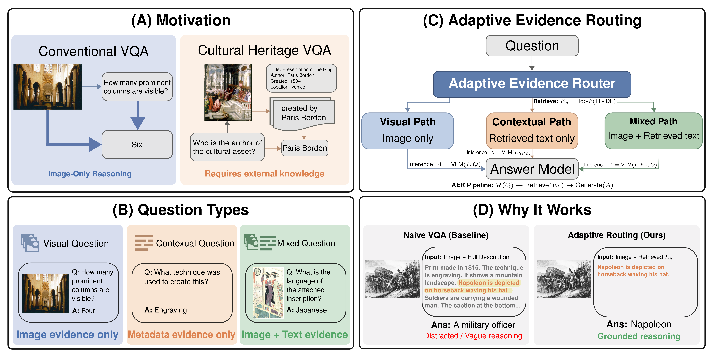

# Adaptive Evidence Routing for Cultural Heritage Visual Question Answering


This repository contains research code for **Adaptive Evidence Routing (AER)** for cultural heritage visual question answering. The project studies how to answer VISCOUNTH-style questions using the evidence source each question actually needs: the image, contextual metadata/description text, or a combination of image and retrieved text. The code is organized for lightweight reproduction without committing datasets, model weights, generated outputs, or private paper metadata.

<p align="center">
  
</p>

<p align="center">
  <em>Adaptive Evidence Routing routes each cultural heritage VQA question to the evidence source it actually needs: visual, contextual, or mixed.</em>
</p>

## Why This Matters

Cultural heritage VQA is heterogeneous. Some questions are visual, such as color, shape, or visible objects. Some are contextual, such as author, period, owner, or location. Others need both the image and text evidence, such as inscriptions or depicted elements. AER treats cultural heritage VQA as an evidence-selection problem: route each question to the evidence source it needs instead of sending every sample through one fixed multimodal prompt.

## Key Features

- VISCOUNTH English subset preparation and eval-subset utilities
- TF-IDF sentence retrieval over cultural-property descriptions
- Template-aware answer extraction for structured heritage question types
- Image-only, text-only, and naive multimodal baselines
- AER and AER-TextFirst style routed variants
- Ablation scripts for extraction, normalization, routing, and policy choices
- Sample-size robustness evaluation and plotting utilities
- Optional VLM wrappers for InternVL, MiniCPM, and Qwen backbones

## Method Overview

<p align="center">
  
</p>

1. **Retrieve focused textual evidence** using top-k sentence retrieval from the metadata or description.
2. **Apply template-aware answer extraction** to recover concise answers when metadata directly contains the answer.
3. **Use policy-guided VLM fallback** only when extraction is insufficient, choosing text-only, image-only, or image+text evidence.
4. **Normalize the final answer** into a short-answer format for evaluation.

## Repository Structure

```text
.
├── README.md
├── CITATION.cff
├── CONTRIBUTING.md
├── configs/
│   └── base_config.yaml
├── data/
│   └── README.md
├── docs/
│   ├── assets/
│   │   ├── aer-overview.png
│   │   └── aer-pipeline.png
│   ├── LICENSE_NOTE.md
│   ├── dataset_setup.md
│   ├── experiment_guide.md
│   ├── literature_tracker.md
│   ├── project_overview.md
│   └── roadmap.md
├── metadata/
│   ├── dataset_notes.md
│   └── viscounth_route_map.json
├── notebooks/
│   └── README.md
├── paper/
│   ├── README.md
│   ├── abstract.md
│   └── outline.md
├── results/
│   └── README.md
├── scripts/
│   ├── README.md
│   ├── baselines/
│   ├── data/
│   ├── evaluation/
│   ├── experiments/
│   ├── figures/
│   └── setup/
├── src/
│   ├── README.md
│   ├── dataset_registry.py
│   ├── utils.py
│   └── aer/
└── tests/
    └── README.md
```

## Installation

1. Clone the repository:

```bash
git clone https://github.com/nichula01/heritage-workshop.git
cd heritage-workshop
```

2. Create the base conda environment:

```bash
conda env create -f environment.yml
conda activate heritage_workshop
```

3. Install the lightweight Python requirements:

```bash
python -m pip install -r requirements.txt
```

4. Install optional model-specific dependencies only when running VLM inference:

```bash
python -m pip install -r requirements-models.txt
```

For MiniCPM-specific experiments, see `environment_minicpm.yml` and `scripts/setup/setup_minicpm_env.sh`.

## Dataset Setup

VISCOUNTH data must be downloaded separately according to its source terms and license. Dataset files are intentionally ignored by Git.

Expected local layout:

```text
data/
├── raw/
│   ├── viscounth_repo/
│   ├── viscounth_extracted/
│   ├── viscounth_images_small/
│   └── viscounth_images_eval300/
└── processed/
    └── viscounth/
```

See [docs/dataset_setup.md](docs/dataset_setup.md) for the full setup notes.

## Quick Start

Inspect the expected VISCOUNTH layout:

```bash
bash scripts/data/check_viscounth_layout.sh
python scripts/data/inspect_viscounth_archives.py
```

Extract the English subset and build processed metadata:

```bash
python scripts/data/extract_viscounth_english.py
python scripts/data/build_viscounth_subset.py
python scripts/data/build_paper_eval_subset.py
```

Build image manifests and prepare AER inputs:

```bash
python scripts/data/build_eval300_image_manifest.py
python scripts/data/download_viscounth_images_eval300.py
python scripts/experiments/run_aer_prepare_eval300.py
```

Run baselines and routed AER variants:

```bash
python scripts/baselines/run_internvl_image_only_eval300.py
python scripts/baselines/run_internvl_text_only_eval300.py
python scripts/baselines/run_internvl_naive_multimodal_eval300.py
python scripts/experiments/run_internvl_aer_v4_1_eval300.py
```

Evaluate predictions:

```bash
python scripts/evaluation/evaluate_predictions_basic.py results/internvl25_2b_aer_v4_1_eval300/predictions.csv
```

All paths above are relative to the repository root. Generated outputs under `data/`, `outputs/`, and `results/` are local artifacts and are ignored by Git.

## Results

We report paper-level draft experiments on the English-only VISCOUNTH evaluation subset of 298 samples. The evaluation uses two short-answer metrics, both reported as percentages:

- **Exact Match (EM)**: prediction exactly matches the normalized gold answer.
- **Contains**: relaxed match where the gold answer is contained in the prediction or vice versa.

### Main comparison

| Method | EM ↑ | Contains ↑ |
|---|---:|---:|
| Image-only baseline | 8.72 | 10.07 |
| Text-only baseline | 37.25 | 45.97 |
| Naive multimodal baseline | 13.09 | 22.15 |
| Adaptive Evidence Routing | 38.26 | 51.34 |
| **AER-TextFirst** | **44.97** | **53.69** |

### Performance by question type

| Method | Visual EM ↑ | Contextual EM ↑ | Mixed EM ↑ |
|---|---:|---:|---:|
| Image-only baseline | 20.0 | 1.0 | 5.1 |
| Text-only baseline | 50.0 | 38.4 | 23.2 |
| Naive multimodal | 23.0 | 6.1 | 10.1 |
| AER | 50.0 | 34.3 | 30.3 |
| **AER-TextFirst** | **54.0** | **41.4** | **39.4** |

### Ablation study

| Variant | EM ↑ | Contains ↑ |
|---|---:|---:|
| **AER-TextFirst** | **44.97** | **53.69** |
| w/o extractor | 38.93 | 47.99 |
| w/o normalization | 42.47 | 52.65 |
| w/o template policy, global text-first | 44.63 | 53.69 |
| route-based fallback policy | 29.19 | 35.91 |
| retrieved-only extraction | 40.94 | 51.34 |
| full-description-only extraction | 44.30 | 53.36 |
| w/o SHAPE image-only override | 43.62 | 51.68 |

Paper-reported draft results suggest:

- AER-TextFirst performs best overall.
- Text-only is much stronger than image-only, showing the importance of metadata in cultural heritage VQA.
- Naive image+full-description prompting performs poorly, showing that adding more context can distract the model.
- The strongest gains appear on mixed questions, supporting question-conditioned evidence routing.
- The extractor is an important component, since removing it drops EM from 44.97 to 38.93.

> These numbers are from draft paper experiments on a 298-sample English-only VISCOUNTH evaluation subset and should be reproduced locally before being treated as final benchmark results.

## Reproducibility Notes

- Default seed is `42` where scripts construct subsets or sample trials.
- The eval subset should be regenerated from local VISCOUNTH files and recorded with its stats JSON.
- VLM results depend on model checkpoint, quantization, prompt wrapper, hardware, and library versions.
- GPU-backed scripts are optional and should not be required for CPU-only tests.
- Keep generated predictions, logs, cached models, and downloaded data out of Git.

## Citation

Citation information is not finalized. See [CITATION.cff](CITATION.cff) for placeholders. If you use this code, please cite the associated paper once available.

## Acknowledgements

This project builds on the VISCOUNTH dataset and open VLM backbones available through the broader PyTorch and HuggingFace ecosystems, including InternVL, MiniCPM, and Qwen model families.

## Contact

- GitHub: [nichula01](https://github.com/nichula01)
- Email: e20425@eng.pdn.ac.lk
